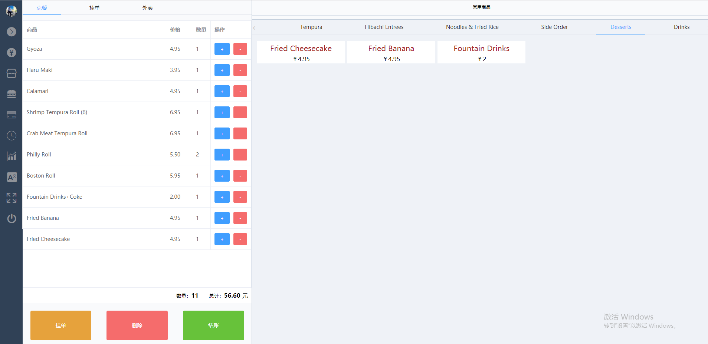

#  Vue 店铺接单和后台管理系统


:online-order-system：基于 Vue(2.6) + vuex + vue-router + vue-axios + element-ui + sortablejs + sortablejs + Scss + ES6 等开发一款自适应接单管理系统（手机/平板电脑/PC）

:yum: 项目演示地址：[接单和管理系统](http://pos.migaox.com)，或者可以扫描二维码访问：
 


## Project setup
```
yarn install
```

### Compiles and hot-reloads for development
```
yarn run serve
```

### Compiles and minifies for production
```
yarn run build
```

## 开发目的

通过学习开发一个 Vue 全家桶项目，让自己更熟练的使用 Vue 全家桶、模块化开发、ES6 等等知识，提高自己的技术能力。


## Picture paints thousand words
## PC端/手机端/平板电脑

## 前台

#### 首页

#### 订单显示

#### 中文导航栏

#### 英文导航栏

#### 更多选项


## 后台管理

#### 后台管理首页

#### 后台管理导航栏

#### 可视化数据

#### 员工管理列表

#### 订单列表

#### 食品列表

#### 食品列表拖拽

#### 添加食品

#### 管理员信息设置

#### 店铺信息设置


## 手机端

#### 手机接单页面


## 平板电脑

#### 平板电脑接单页面

